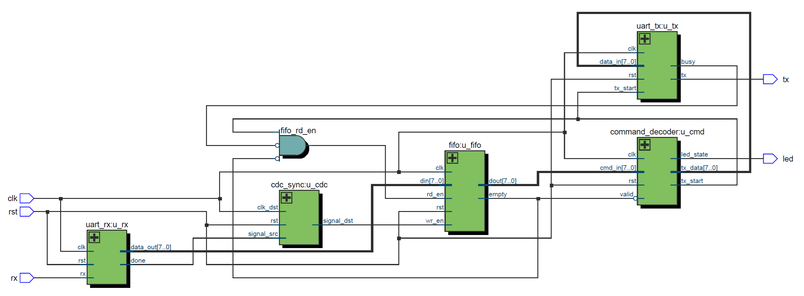
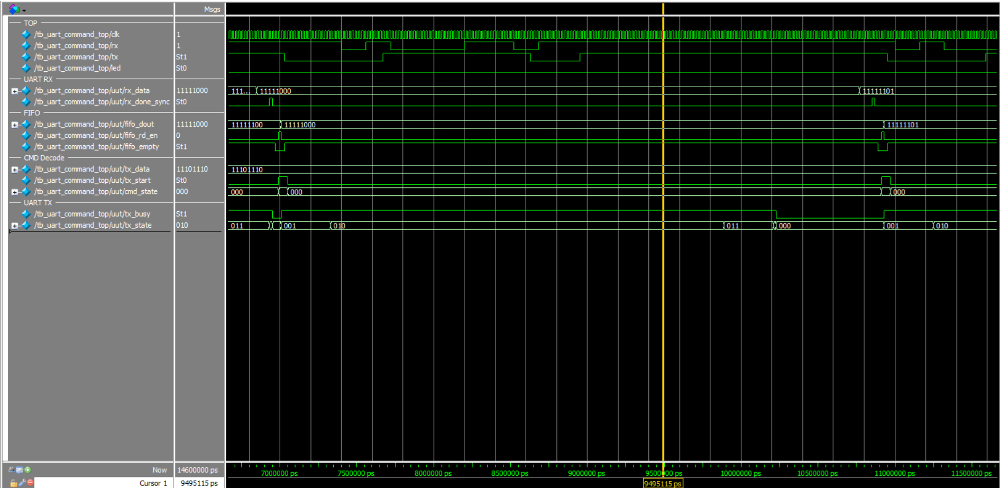

# UART Command System

This project implements a UART command-response system in Verilog. The design receives serial commands and controls an LED accordingly. It also includes a FIFO buffer and cross-clock domain synchronization.

---

## 🧩 Project Structure

| File | Description |
|------|-------------|
| `uart_rx.v` | UART Receiver |
| `uart_tx.v` | UART Transmitter |
| `cdc_sync.v` | Cross-domain signal synchronizer |
| `fifo.v` | Simple FIFO for buffering commands |
| `command_decoder.v` | Decodes received command bytes and triggers responses |
| `uart_command_top.v` | Top-level module integrating all components |
| `tb_uart_command_top.v` | Testbench for simulation |
| `wave_tb_uart_command_top.png` | Simulated waveform |
| `RTL_uart_command_top.png` | RTL schematic of top-level module |

---

## 🔁 Supported UART Commands

| Command | Description | HEX |
|---------|-------------|-----|
| `LED ON` | Turns on the LED | `0xA1` |
| `LED OFF` | Turns off the LED | `0xA2` |
| `READ LED` | Returns LED status (1 or 0) | `0xB1` |
| `RESET` | Resets the system | `0xC1` |

---

## 🧠 RTL Block Diagram

---

## 📶 Simulation Waveform

This waveform is generated by simulating `tb_uart_command_top.v` in ModelSim:

---

## 🛠️ How to Simulate

1. Open **ModelSim**
2. Compile all modules and testbench
3. Run the simulation for at least **5 μs**
4. Observe the `tx`, `led`, `tx_state`, and other debug signals

